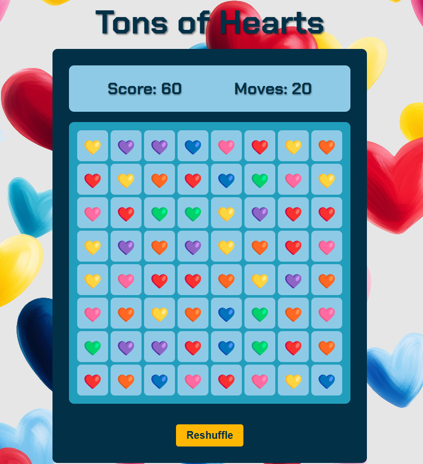

# Tons of Hearts

Tons of Hearts website: (https://klb-dev.github.io/hearts-and-more-hearts/)[Tons of Hearts]

## Project
Created a Match 3 game. You have x amount of moves and try to generate the most points. If no moves are left you can reshuffle the board if you still have moves. Created with different color heart to add thought process in matching the tiles. 
## Learning
I wanted to create a simple game with HTML, CSS, and JavaScript. The majority is the JS with multiple functions. I generated the board, have scoring added for number of hearts matched, created the count down for the moves. Each time you start a new game the number of moves is a different value between 20 and 35. This project was a way for me to constantly use the native code. I did not add images for the hearts, but used emojis within an array. The hardest part was creating the functions for the board, dropping the tiles after cleared, and having a function to make sure there are no matches before pressing the reshuffle button. This took me beyond the normal knowledge of JavaScript. I am self taught with no bootcamps, but I have enrolled in Zero to Mastery which allows me to watch videos and do specific exercises. Some classes are not using code from previous versions, but reading documentation about the new aspects of JS (ECMAScript 2020).
## Future
I would like to add different levels. Right now you play the game with the moves and hope for a high score. I also want to added the score on the board when the moves are complete, right now it shows as an alert.
I need to update the CSS for different devices. It is only desktop as of now. Need some media queries, but wanted to focus on the JS in the beginning. 
I would love to make it a mobile app, but have not learned enough as to how to deploy and make that a reality. Can only dream, because I will get there. 
I am proud of the game as it is my first JS game. 
## Author
**Karen Byrd**
*2025*
 
klbdev88@gmail.com
  
